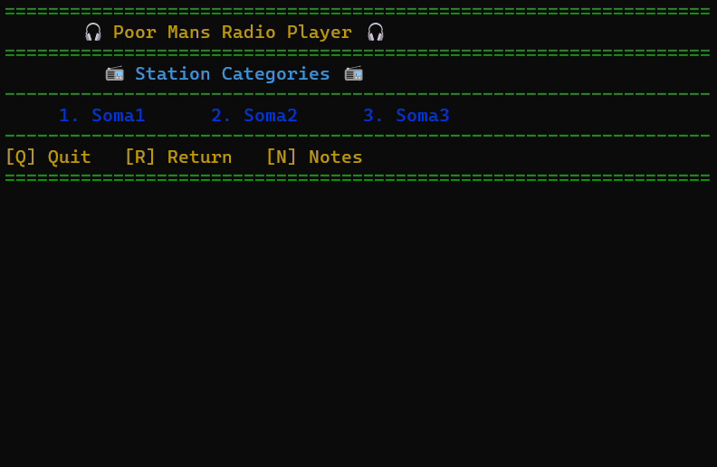

<div style="display: flex; align-items: center;">
  
  <h1>♪♫ pnimrp - Poor Man's Radio Player in Nim ♫♪</h1>
</div>

Are you on the terminal and want to listen to music without opening
the web browser? **pnimrp** is here to save the day! 🎉

With a collection of **30+ modifiable radio station links** (JSON),
you can browse, play, pause, and mute your favorite stations—all from
the comfort of your terminal. No more fiddling with PLS files! 🚀

Inspired by [Poor Man's Radio Player](https://github.com/hakerdefo/pmrp),
**pnimrp** takes things to the next level with added features and
improvements.

## 🌟 Key Features

- **Portable**: Works seamlessly on Unix and Windows.
- **Easy to Use**: Simple menu-driven interface.
- **Modifiable Stations**: Edit JSON files to add or remove stations.
- **Now Playing**: Displays the currently playing song.
- **Async Input**: Non-blocking key polling for smooth controls.
- **Lightweight**: Minimal dependencies, fast and efficient.

## 🚀 Installation

### Step 1: Install **mpv** with development files for your distribution.

### Step 2: Install the Nim compiler:

- **Unix**:
  ```bash
  curl https://nim-lang.org/choosenim/init.sh -sSf | sh
  ```
- **Windows**:
  Download the latest release from [choosenim](https://github.com/dom96/choosenim/releases).
- **Other Distros**:
  Follow the official [Nim installation guide](https://nim-lang.org/install.html).

### Step 3: Install **pnimrp**:
```bash
nimble install pnimrp
```

Or compile it manually:
```bash
nim c -d:release pnimrp
./pnimrp
```

## 🎥 Demo



## 🎮 Controls

| Key            | Action                                  |
|----------------|-----------------------------------------|
| **1-9, a-l**   | Select menu options                     |
| **R**          | Return to the previous menu             |
| **Q**          | Quit the application                    |
| **P**          | Pause/resume playback                   |
| **M**          | Mute/unmute                             |
| **+**          | Increase volume                         |
| **-**          | Decrease volume                         |

## 📖 Documentation

For detailed usage instructions, see:
- 📄 **doc/user.md**: User guide.
- 📄 **doc/installation.md**: Installation instructions.

To generate HTML documentation:
```bash
nim rst2html file.rst
```

Then open **htmldocs/file.html** in your browser.

## 🤝 Contributing

We welcome contributions! Here’s how you can help:

1. **Report Bugs**: Open an issue on GitHub.
2. **Suggest Features**: Share your ideas for new features.
3. **Submit Pull Requests**: Fix bugs or add new functionality.

Please read our [Contributing Guidelines](CONTRIBUTING.md) for more details.

## 📜 License

**pnimrp** is licensed under the **Mozilla Public License 2.0 (MPL-2.0)**. See the [LICENSE](LICENSE) file
for details.

## 🙏 Credits

- **pmrp**: Inspiration and initial codebase.💡
- **libmpv**: Playback functionality.📻
- **c2nim**: Wrapping objects.
- **illwill**: Async input handling.
- **ChatGPT 3.5**: Documentation and code improvements.🤖
- **Claude 3.5 Sonnet**: Documentation and brainstorming.
- **DeepSeek-V3**: Documentation and Code improvements 🥰
- **You**: For using and supporting this project! ❤️

## 🎉 Happy Listening!

Thank you for using **pnimrp**! If you enjoy the project, consider giving it a ⭐
on GitHub or sharing it with your friends. Let’s make terminal radio awesome! 🎶